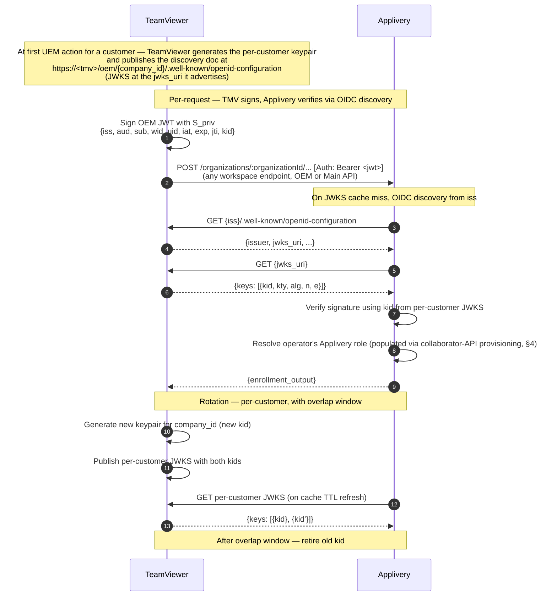
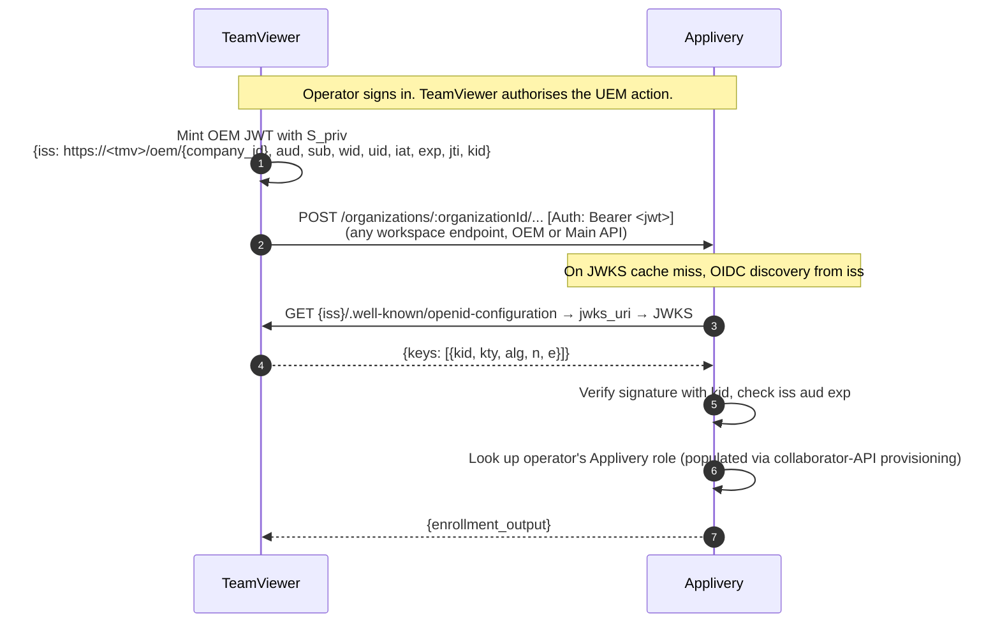

# TMV Proposal

---

tags:

* project
* teamviewer-one
* uem
* applivery
* authentication
* design
* external created: 2026-04-25 status: draft-pending-dual-approval scope: external-facing counterproposal for the TeamViewer ↔ Applivery UEM integration authentication and authorisation model. To be shared with Applivery ahead of the joint review. approvals: applivery: pending  # business workflows (provisioning chain, lifecycle, role model) teamviewer: pending  # security flows (signing model, JWT claims, JWKS, rotation) related:
* "\[\[UEM - Applivery Integration Design\]\]"
* "\[\[UEM - Applivery OEM Auth Review\]\]"


---

# TeamViewer ↔ Applivery UEM Integration — Authentication Counterproposal

> \[!warning\] Draft — pending dual approval This document is a **draft counterproposal** and is **not yet agreed by either party**. Two approvals are required before any item described here is treated as binding:
>
> * **Applivery** owns sign-off on the **business workflows**: the provisioning chain (§4.2), lifecycle events (§4.3), the role and identity model (§4.1), and the OEM-first usage rule (§1 point 3).
> * **TeamViewer** owns sign-off on the **security flows**: the asymmetric-signing model and per-customer scope (§3.1–§3.4), tenant-admin scope tokens and the audience model (§3.5), verifier-side enforcement (§3.6), and the open items in §3.7.
>
> Until both approvals are recorded in the `approvals:` frontmatter block, every claim in this document is provisional and subject to change.

> **Purpose.** Propose an asymmetric-signing variant of the integration auth model that supersedes shared-secret credential handoff with standard OIDC discovery + JWKS verification. Frames concrete asks for changes on the Applivery side, with the supporting design choices on the TeamViewer side described at the level needed to evaluate the contract.
>
> **Companion to** the published Applivery wiki pages on OEM Authentication, OEM API Reference, and OEM Playground Guide.


---

## 1. TL;DR


1. **Per-customer asymmetric signing on the wire — covering the whole per-customer surface.** TeamViewer holds one private key per customer; Applivery verifies via standard JWKS published per-customer. The JWT's `iss` claim drives discovery — no per-customer registration state on Applivery's side. The same per-customer JWT authenticates **every** workspace-scoped endpoint under `/organizations/:organizationId/...` — both the OEM workspace subtree (`/organizations/:organizationId/oem/...`) and the Main API workspace endpoints (everything else under that prefix). This collapses what Applivery's published OEM proposal splits into two per-user HS256-signed JWTs (`OWNER_OEM_JWT` signed with `OWNER_SECRET` for owner-scoped ops, `USER_OEM_JWT` signed with `USER_SECRET` for user-scoped ops) into one asymmetric keypair per customer; the `uid` claim identifies the workspace collaborator the JWT acts as, and Applivery's stored role on that collaborator is authoritative for per-request authorisation.
2. **Tenant-admin endpoints follow the same model.** Workspace bootstrap, billing, reporting, and audit are authenticated with scoped JWTs against a tenant-level JWKS, replacing the static `MASTER_SERVICE_ACCOUNT_BEARER` and `BILLING_SERVICE_ACCOUNT_BEARER` bearers.
3. **OEM-first usage rule for any per-customer call.** When the OEM API has an endpoint for a use case, that path is authoritative; the Main API is the documented fallback only when no OEM equivalent exists. The auth model doesn't care — the per-customer JWT works on both surfaces — but the integration commits to the OEM-first preference. For operator provisioning specifically (§4), this means `POST /organizations/:organizationId/oem/users/` for creation (OEM API), then `PUT` / `DELETE` on `/organizations/:organizationId/collaborators/:organizationCollaboratorId` for role updates and removal (Main API, no OEM equivalents). No separate provisioning channel, no static SCIM bearer. ==How TMV want to manage SCIM integration? To follow SCIM protocol, we should provide an SCIM endpoint and a bearer==
4. **No shared secrets at any layer.** No `oemSecret` issuance, no static tenant bearers, no symmetric signing material in flight or at rest.
5. **Standard OIDC mechanics throughout.** RFC 7517 (JWKS), RFC 7519 (JWT), RFC 8414 (OAuth/OIDC discovery). The proposal asks Applivery to extend the OEM and admin endpoints with one verification path that follows the discovery-document model used by Auth0 Organizations, Azure AD multi-tenant, and Okta.


---

## 2. Comparison vs. the published model

| Dimension | Published Applivery model (Apr 2026) | This counterproposal |
|-----------|--------------------------------------|----------------------|
| OEM JWT signing algorithm | HS256 (HMAC-SHA256) with `oemSecret` | Preferably EdDSA (alternatively RS256 / ES256) |
| Signing-key custody | Applivery generates, ships to integrator, retains for verification | TeamViewer generates and holds the private key; Applivery never has it |
| Per-customer key material on Applivery side | Per-user and per-owner `oemSecret` stored in Applivery DB | Per-customer public key only, fetched on demand via OIDC discovery, cached per JWKS TTL |
| Per-customer registration state on Applivery side | Yes — secrets stored against owner / user records | No — JWT `iss` claim resolves to the discovery doc |
| Tenant-level endpoint auth | Static `MASTER_SERVICE_ACCOUNT_BEARER` / `BILLING_SERVICE_ACCOUNT_BEARER`, fixed per tenant | Scoped tenant-admin JWTs against a tenant-level JWKS. Scope names and the cross-tenant endpoints each scope gates are still to be defined jointly with Applivery; §3.5 has an illustrative starter set. |
| Per-customer (workspace) endpoint auth | Two HS256 JWT types per workspace: `OWNER_OEM_JWT` (`OWNER_SECRET`, owner-scoped) and `USER_OEM_JWT` (`USER_SECRET`, user-scoped) | One per-customer asymmetric JWT covers the entire `/organizations/:organizationId/...` workspace surface — both the OEM subtree (`/organizations/:organizationId/oem/...`) and the Main API workspace endpoints (everything else under that prefix), owner- and user-scoped operations alike |
| JWT claims | `wid`, `uid`, `iat`, `exp`           | Adds `iss`, `aud`, `sub`, `jti`, `kid` (header); `scope` on tenant-admin tokens.  ==The scope is managed directly in Applicery, with the role permissions feature== |
| Token lifetime | Integrator-defined; Playground default 1 hour | Minutes, with a server-side max-TTL ceiling enforced by Applivery |
| OEM-routing transport | `Authorization: OEM <jwt>` overloads the `Authorization` header for OEM-middleware routing | Standard `Authorization: Bearer <jwt>` for the JWT; separate `X-Applivery-Integration: oem` header for routing. ==Perhaps it's better if we send OIDC instead of OEM== |
| Algorithm-confusion exposure | Acceptable `alg` not pinned by published verifier docs | Pinned to asymmetric algorithms only; `HS*` and `none` rejected |
| Rotation  | Per-secret `PUT /admin/organizations/:organizationId/oem/users/:userId/secret` (owner) and `PUT /organizations/:organizationId/oem/users/:userId/secret` (user); no path for tenant bearers | Per-key rotation via JWKS overlap; standard OIDC mechanics for both per-customer and tenant-level |
| User provisioning | Invite + per-user `oemSecret` issuance | OEM-first: `POST /organizations/:organizationId/oem/users/` (creates user + collaborator), followed by `PUT /organizations/:organizationId/collaborators/:organizationCollaboratorId` with `{role}` to set the operator's role. All under the per-customer JWT. The `oemSecret` returned by the create call is ignored — no role under asymmetric signing. ==For the MDM vertical, the "roles" are managed by Segment Permissions/ Segment Roles; the collaborator role should always be "unassigned" except for the owner, who is "owner". The owner will be the TMV user who can perform actions over the workspace == |
| Role propagation | Set via collaborators endpoint, stored server-side | Same collaborators endpoint — `PUT /organizations/:organizationId/collaborators/:organizationCollaboratorId` to update role, `DELETE` to remove. Same per-customer JWT. ==Same comment as before== |


---

## 3. Wire-level: asymmetric signing

### 3.1 Model

TeamViewer holds the per-customer signing private key (`S_priv`). Applivery holds only the matching public key (`S_pub`), fetched on demand from a TeamViewer-published JWKS. No shared secret exists in either direction.

On the wire, the JWT is carried in the standard `Authorization: Bearer <jwt>` header. Routing to Applivery's OEM middleware uses the dedicated `X-Applivery-Integration: oem` request header — agreed jointly, replacing the prior `Authorization: OEM <jwt>` scheme that overloaded `Authorization` for routing. The `Authorization` header stays free of integrator-specific scheme values, so OAuth-aware SDKs, proxies, WAFs, and logging pipelines work without special-casing. The header is vendor-prefixed and value-extensible if Applivery later introduces non-OEM integration channels.

### 3.2 Per-customer scope

The signing keypair is **per-customer** (one keypair per Applivery workspace / TeamViewer company), not integrator-wide and not per-user. Per-customer scope yields:

* Per-customer rotation without disturbing other customers' caches.
* Per-customer revocation, with bounded blast radius if a key is compromised.
* A single customer-scoped JWKS document, kept small.

The keypair is published to Applivery via a per-customer JWKS URL, addressable from the JWT itself. Same pattern as Azure AD multi-tenant, Auth0 Organizations, and Okta — one JWKS per logical tenant, discovered from the token rather than registered statically.

### 3.3 JWT shape

Minimum claim set on per-customer OEM JWTs:

| Claim | Value |
|-------|-------|
| `iss` | `https://<tmv-canonical-host>/oem/{company_id}` — OIDC discovery anchor; host pinned to a registered TeamViewer root and bound to `wid` at workspace bootstrap (§3.6). ==We should add a white-listed domain or a tmv-canonical-host. Instead, any person knowing the content of the JWT can regenerate it with the same values, but pointing to a custom iss with these public secrets, because Applivery completely believes in that information and does not have any way of double-checking it (Already commented in 3.6)==  |
| `aud` | Pinned by Applivery (e.g. `applivery`) |
| `sub` | The TeamViewer operator's Applivery user ID |
| `wid` | Applivery workspace ID |
| `uid` | Applivery user ID (may equal `sub` depending on Applivery convention) |
| `iat`, `exp` | Short-lived; minutes, not hours |
| `jti` | Per-token unique identifier — carried for forward-compatibility; revocation handling is out of scope for this proposal |
| `kid` (header) | Selects the key from the JWKS |

Signing algorithm: `**EdDSA**` **with Ed25519** (per RFC 8037) preferred — smaller keys (32 bytes), smaller signatures (64 bytes), faster verification, and no parameter-choice pitfalls (no key-size decision, no curve selection beyond the spec). `ES256` (ECDSA over P-256) and `RS256` (RSA-PKCS#1-v1.5 with SHA-256) are acceptable fallbacks if Ed25519 is not supported by Applivery's verifier stack. Final choice confirmed jointly (§3.7); if RS is chosen as fallback, the RSA key size will be set on the TeamViewer side, with RSA-2048 as the lower bound and RSA-3072 preferred for new deployments. Applivery pins the acceptable `alg` list on verification (see §3.6).

### 3.4 Public-key distribution: OIDC discovery



Standard multi-tenant OIDC: RFC 8414 discovery + RFC 7517 JWKS. No custom endpoint on Applivery's side. No per-customer registration state — the JWT's `iss` is self-describing.

### 3.5 Tenant-admin operations use the same mechanism

Workspace bootstrap, cross-workspace billing, reporting, and audit endpoints sit outside any specific customer, so they do not use the per-customer keypair. They use **per-scope TeamViewer-side service signing keypairs** — one keypair per tenant-admin scope — published at a single tenant-level JWKS under distinct `kid`s. JWTs carry an OAuth-style `scope` claim, and the `aud` claim is set per-scope: Applivery issues one **service account ID** per scope and shares them with TeamViewer, so each tenant-admin endpoint accepts only the JWT carrying its scope's `aud`. Verification is the same path as per-customer OEM JWTs, with a different `iss`, a scope check, and the per-scope `aud` check. =="Scopes" → permissions → actions allowed are managed by the Applivery role/permissions feature, which also applies to tenant endpoints. Applivery supports actions at endpoint granularity. We think the scope is not necessary. This implies certain changes in subsequent documentation. ==

> **The scope set below is illustrative, not final.** Scope names, granularity, and the cross-tenant endpoints each scope gates still need to be defined jointly with Applivery (§3.7 row 3). The table is a starting point for that conversation.

| Scope (illustrative) | Endpoints (illustrative) |
|----------------------|--------------------------|
| `workspace:manage`   | `POST /admin/organizations/oem-bootstrap` and workspace lifecycle (update, suspend, delete) |
| `billing:manage`     | Billing plans, subscriptions |
| `reporting:read`     | Cross-workspace BI (used / licensed devices) |
| `audit:read`         | Cross-workspace audits and logs |

**Example.** Each scope's `aud` is the service-account identifier Applivery issues for that scope, opaque to TeamViewer and configured once at integration setup. If those identifiers were `sa_workspace_manage`, `sa_billing_manage`, `sa_reporting_read`, `sa_audit_read`, a JWT minted for `POST /admin/organizations/oem-bootstrap` would have this decoded shape (on the wire: `header.payload.signature`, base64url-encoded):

Header:

```json
{
  "alg": "EdDSA",
  "kid": "tmv-tenant-workspace-2026-04",
  "typ": "JWT"
}
```

Payload:

```json
{
  "iss": "https://<tmv>/oem",
  "aud": "sa_workspace_manage",
  "scope": "workspace:manage",
  "sub": "tmv-uem-tenant-ops",
  "iat": 1777298400,
  "exp": 1777298700,
  "jti": "01J9P5K7T3M5W8C2X4N6R8B0Q3"
}
```

Carried in the standard `Authorization: Bearer <encoded-jwt>` header (same wire convention as per-customer JWTs, §3.1; routing to the OEM admin surface uses `X-Applivery-Integration: oem` as before). On verification, Applivery resolves the `kid` against the tenant-level JWKS, validates the EdDSA signature, and checks `iss`, `exp`, `iat`, and `aud == sa_workspace_manage`. A token signed with the billing scope's key (different `kid`, `aud: "sa_billing_manage"`, `scope: "billing:manage"`) is rejected by the bootstrap endpoint even though its signature validates against a key in the same tenant JWKS. This is the per-resource `aud` pattern OAuth 2.0 Resource Indicators ([RFC 8707](https://datatracker.ietf.org/doc/html/rfc8707)) defines, applied at scope granularity; Auth0's API audiences work the same way at API granularity.

**Discovery and JWKS.** Applivery fetches the tenant-level OIDC discovery document from the issuer's `.well-known` path on first use (and on JWKS cache miss), then follows the `jwks_uri` it advertises to retrieve the verifying public keys. Discovery doc served at `https://<tmv>/oem/.well-known/openid-configuration`:

```json
{
  "issuer": "https://<tmv>/oem",
  "jwks_uri": "https://<tmv>/oem/.well-known/jwks.json",
  "id_token_signing_alg_values_supported": ["EdDSA"],
  "subject_types_supported": ["public"],
  "response_types_supported": ["id_token"]
}
```

JWKS at the `jwks_uri` — one entry per tenant-admin scope, each with a distinct `kid` so the verifier picks the right key from the JWT header (`x` is the base64url-encoded Ed25519 public key, RFC 8037):

```json
{
  "keys": [
    {
      "kty": "OKP",
      "crv": "Ed25519",
      "kid": "tmv-tenant-workspace-2026-04",
      "alg": "EdDSA",
      "use": "sig",
      "x": "11qYAYKxCrfVS_7TyWQHOg7hcvPapiMlrwIaaPcHURo"
    },
    {
      "kty": "OKP",
      "crv": "Ed25519",
      "kid": "tmv-tenant-billing-2026-04",
      "alg": "EdDSA",
      "use": "sig",
      "x": "<base64url Ed25519 public key>"
    },
    {
      "kty": "OKP",
      "crv": "Ed25519",
      "kid": "tmv-tenant-reporting-2026-04",
      "alg": "EdDSA",
      "use": "sig",
      "x": "<base64url Ed25519 public key>"
    },
    {
      "kty": "OKP",
      "crv": "Ed25519",
      "kid": "tmv-tenant-audit-2026-04",
      "alg": "EdDSA",
      "use": "sig",
      "x": "<base64url Ed25519 public key>"
    }
  ]
}
```

End-to-end: the JWT above carries `iss: "https://<tmv>/oem"` and `kid: "tmv-tenant-workspace-2026-04"` → Applivery fetches `<iss>/.well-known/openid-configuration` → reads `jwks_uri` → fetches the JWKS → picks the key by `kid` → verifies the signature → runs the §3.6 claim checks (including `aud == sa_workspace_manage`).

The per-customer flow (§3.4) uses the same document shape: a per-customer discovery doc at `https://<tmv>/oem/{company_id}/.well-known/openid-configuration` and a per-customer JWKS holding the customer's signing key (two keys during a rotation overlap window).

Properties:

* No static integrator-wide bearers, and no manual credential handoff at integration setup. Bootstraps from the tenant-level JWKS only.
* Rotation of the tenant signing key for any scope is TeamViewer-initiated and unilateral; Applivery's cache refreshes on its own TTL.
* Every tenant-admin call is attributable to a specific TeamViewer identity (in the `sub` claim) and an auditable scope, not a shared service credential.
* Per-scope separation prevents cross-scope minting — e.g. a billing-scope identity cannot mint a `workspace:manage` token. ==Correct by e.g., need to be changed, remove scope relation==

Final scopes and the cross-tenant endpoints they gate are pinned jointly with Applivery during this review; the starter table earlier in this section is illustrative.

### 3.6 What we ask Applivery to enforce on verification

For the design to deliver asymmetric-cryptography guarantees, the verifier side must enforce:

* **Pin the acceptable** `**alg**` **to the single agreed algorithm** (e.g. `EdDSA` if Ed25519 is selected per §3.7). Reject every other value — including other asymmetric algorithms, `alg: HS*`, and `alg: none` — regardless of `kid`. Strict allowlisting at one value closes the classic algorithm-confusion attack (using an RSA public key as an HMAC secret) and minimises the verifier's exposed crypto-library surface (RSA padding variants, ECDSA edge cases, etc.). Future algorithm changes are handled as a rotation event with overlap: add the new `alg` to the allowlist alongside a new `kid`, drain the old `kid`, then remove the old `alg` from the allowlist.
* **Validate** `**iss**`**,** `**aud**`**,** `**exp**`**, and** `**iat**`**.** Treat a missing `iss` as the token being unbound to any customer; reject rather than guess. **Pin the acceptable** `**iss**` **to a registered TeamViewer root** (e.g., the host portion of `https://<tmv-canonical-host>/oem/{company_id}`, agreed at integration setup). Applivery does not perform OIDC discovery against arbitrary issuers — only against hosts in the registered allowlist — closing the trust-on-first-use surface. The per-customer `{company_id}` suffix beyond the registered root is opaque to Applivery; only the host (and optional path prefix) is whitelisted. `jti` is carried for forward-compatibility — accept it without rejecting, but no validation/denylist required under this proposal.
* **Bind** `**iss**` **to** `**wid**` **at workspace onboarding.** At workspace creation under the `workspace:manage` tenant-admin scope (§3.5), TeamViewer registers the per-customer `iss` that will sign all future JWTs for that workspace. Applivery stores the binding alongside the workspace record. On every per-customer request, Applivery rejects the JWT if the `iss` does not match the stored binding for the requested `wid`. This contains blast radius: even if a per-customer signing key is compromised and the attacker mints tokens that pass signature verification, Applivery refuses to apply them to any workspace other than the one bound to that `iss` — no cross-customer pivot.
* **Look up keys by** `**kid**` and verify using that specific key's declared algorithm — never an algorithm derived from the JWT header alone.
* **Verify JWKS provenance** — TLS with certificate validation on every JWKS fetch; certificate pinning or a published fingerprint preferred.
* **Enforce a server-side max-TTL ceiling** on the `exp` claim, regardless of what the integrator requests.

Corresponding TeamViewer-side commitments to make the asymmetric guarantee end-to-end: no API path exports `S_priv` from TeamViewer; rotation always overlaps two `kid`s during the cache TTL window so verifiers see a continuous JWKS; no shared-secret fallback path remains available once asymmetric is in force.

### 3.7 Open items for joint alignment

Items left open in this proposal, to be settled in the joint review session:

| #   | Item | Notes |
|-----|------|-------|
| 1   | Signing algorithm — **EdDSA (Ed25519) preferred** | Confirm Applivery's verifier library supports `alg: EdDSA` with `kty: OKP`, `crv: Ed25519` (RFC 8037). If unsupported, fall back to ES256 or RS256. Whichever is chosen becomes the *single* value Applivery accepts on `alg` (§3.6); changing later is a rotation-with-overlap event, not a verifier reconfiguration. JWKS / OIDC discovery mechanics are identical in all three cases. |
| 2   | If RS family chosen as fallback: RSA key size | TeamViewer to confirm. RSA-2048 lower bound, RSA-3072 preferred for new deployments. Applivery's verifier should accept the chosen size. Not relevant if EdDSA or ES256 is selected. |
| 3   | Final scope vocabulary, granularity, and cross-tenant endpoint coverage for tenant-admin JWTs | The §3.5 table is illustrative. Scope names, granularity, and which cross-tenant endpoints each scope gates still need to be defined and agreed with Applivery. |
| 4   | `aud` claim values | Per-customer JWTs: single value, pinned by Applivery (e.g. `applivery`). Tenant-admin JWTs: one service account ID per scope, issued by Applivery (§3.5). Values to be exchanged. |
| 5   | JWKS cache TTL on Applivery side | Drives the rotation overlap window TeamViewer must hold. |
| 6   | Server-side max-TTL ceiling on `exp` | Applivery to set; TeamViewer mints inside it. Minutes-scale expected. |


---

## 4. Role and identity mapping

### 4.1 Applivery identity model

Applivery's identity model has three terms of art used throughout this section:

* **User.** Workspace-agnostic identity record, keyed by email. The same user can be a collaborator across many workspaces. ==This is something that Applivery supports, but in the TeamViewer integration, I don't think that this scenario should happen; all the users should be workspace-scoped, if a same email (user) should access multiple workspaces, each access should have a custom S_priv    ==
* **Collaborator.** A user assigned to a specific workspace. The OEM `POST /organizations/:organizationId/oem/users/` call creates the user and the collaborator record together. The collaborator carries one `role` field (enum: `owner` / `admin` / `editor` / `viewer` / `unassigned`) plus a free-form `tags` array of strings. ==As already mentioned before, these roles only affect the App distribution area, for UEM permissions are managed by Segment-Permissions, and all collaborators should be unassigned except the owner, that do not need to be assigned to any segment permission==
* **Segment.** Applivery's workspace-internal scoping concept. The collaborator's role enum maps onto segment association: `unassigned` is the state of a collaborator with no segment association; `admin` / `editor` / `viewer` correspond to a collaborator associated with a segment in that role; `owner` is the workspace-level service identity not derived from segment association. ==The roles for the UEM area are assigned if the user targets a Segment permission by email or tags, except for the owner. Segments in Applivery are optional because no segment is equal to segment 0. To provide access to this segment or any other, the user should be eligible by the segment permission, and the role (or array of roles) assigned to the Segment permission will be applied to the user. The role of the collaborator only applies to the App distribution area==
* **Segment permission.** A workspace-level configuration object that binds users (by email or group filter) to roles on a specific segment. Created once per workspace at bootstrap via `POST /organizations/:organizationId/segment-permissions/` (Owner JWT in the published flow; permission `base.organization.segmentPermission.create`) — the playground's "Create segment permission" step (J) and a prerequisite for the per-user role tag in step K to grant effective access. Per-user provisioning under this design (§4.2) sets the collaborator `role` field; the segment-permission machinery established at bootstrap is what makes that role grant access on the workspace's segment(s).

(*Naming note.* Applivery is renaming "organization" to "workspace" as a conceptual term; the API path elements still read `/organizations/...` and we follow the wire shape as published.)

Roles consumed by the integration:

| Applivery role | Use under this design |
|----------------|-----------------------|
| `owner`        | Per-workspace service identity TeamViewer holds for workspace-level management. Not mapped from any human TeamViewer role. |
| `admin`        | Operators with full UEM authority on the TeamViewer side. |
| `editor`       | Operators with device-management authority. |
| `viewer`       | Operators with read-only UEM authority. |
| `unassigned`   | Soft-revocation target — collaborator record retained, no role-bound authority. Used for in-place demotion when removing the workspace association is not desired. |

### 4.2 Provisioning under the per-customer JWT (OEM-first)

Role mapping is applied at provisioning time, not at JWT-mint time. The integration follows an **OEM-first rule**: when the OEM API has an endpoint covering a use case, that endpoint is authoritative; calls fall back to the standard workspace endpoints only when no OEM-specific path exists. This matches the path Applivery's published OEM proposal already takes (the OEM API Reference notes: *"The user is later tagged as admin through the non-OEM collaborators endpoint."*).

The provisioning chain has three steps: **create** (user + collaborator), **tag** (set the collaborator's role), and **remove** (delete the workspace association). ==Tags can be assigned in the creation step, make into 2 different requests in the Playground was for didactical proposes==

**Endpoints used for operator provisioning** (verified against the OpenAPI spec, `x-public-api: true` on each):

| Step | Method | Path | Body | Notes |
|------|--------|------|------|-------|
| Create user + collaborator | `POST` | `/organizations/:organizationId/oem/users/` | `email` (required), `firstName`, `lastName` (both optional) | OEM-specific path — authoritative for user creation. Returns `data.collaborator.{id, role, tags, user.{id, email, firstName, lastName, role, ssoUser, picture?}, …}` plus `data.oemSecret` (the per-user signing secret in the published HS256 model — **ignored** under asymmetric signing, no role on TeamViewer's side). The 400 variants documented on this endpoint are `FeatureBlockByPlatformError`, `LimitExceededError`, `UserIsAlreadyACollaboratorError`, and `OnlyAllowForOrganizationOwnerError` — the last gates on the per-customer JWT acting as the workspace `owner`. |
| Set / update role | `PUT`  | `/organizations/:organizationId/collaborators/:organizationCollaboratorId` | `role` and/or `tags` (both optional; `additionalProperties: false`) | No OEM-specific role-update endpoint exists — the collaborators path is the documented one, used under Owner JWT in Applivery's Playground Guide. Permission: `base.people.organizationCollaborator.update`. `role` enum: `owner` \| `admin` \| `editor` \| `viewer` \| `unassigned`. `tags` is an array of strings (each ≤128 chars). ==Modify role will not be needed for TMV integration== |
| Remove | `DELETE` | `/organizations/:organizationId/collaborators/:organizationCollaboratorId` | —    | No OEM-specific delete endpoint exists. Permission: `base.people.organizationCollaborator.remove`. Removes the workspace association entirely; the underlying user record persists. |

Under Applivery's published OEM proposal, these calls are authenticated by the workspace `OWNER_OEM_JWT` (HS256-signed with the workspace-issued `OWNER_SECRET`). Under this counterproposal, the per-customer asymmetric JWT (§3) replaces `OWNER_OEM_JWT` — one keypair per customer instead of one HS256 secret per workspace. The workspace `owner` identity TeamViewer holds (§4.1) carries the gating permissions on all three calls.

The `POST /organizations/:organizationId/oem/users/` response surfaces `data.collaborator.user.id`. TeamViewer keeps that value as the operator's Applivery user identifier and uses it as the `uid` claim in subsequent per-customer JWTs.

Chain of custody for an end-to-end UEM action:


1. **Create.** TeamViewer calls `POST /organizations/:organizationId/oem/users/` with the operator's `email` (and name fields). Applivery returns the collaborator + user record; TeamViewer captures `data.collaborator.id` and `data.collaborator.user.id`. The returned `oemSecret` is ignored. ==oemSecret will be removed==
2. **Tag.** TeamViewer calls `PUT /organizations/:organizationId/collaborators/:organizationCollaboratorId` with `{role: <mapped>}` to set the operator's role from the TeamViewer-side authority mapping (§4.1). ==Tags can be sent in the creation if needed, the role should not be changed in TMV integration==
3. **Operate.** Operator initiates a UEM action against TeamViewer; TeamViewer authorises the request.
4. **Mint.** TeamViewer mints a per-customer JWT with `uid` set to the operator's Applivery `user.id`.
5. **Verify.** Applivery verifies the signature via per-customer JWKS and looks up the collaborator's `role` server-side (set in step 2).
6. **Authorise.** Applivery authorises the action against its stored role.

The JWT does not carry the role as a claim. Applivery's server-side role state is authoritative; the create-then-tag pair keeps it in sync with what TeamViewer knows.

> `**PUT /organizations/:organizationId/oem/users/:userId/secret**` **is not used.** ==Should be removed== The OEM API exposes a per-user secret-refresh endpoint (auth: Owner OEM JWT in the published model) for rotating the HS256 user signing secret. Under per-customer asymmetric signing the user signing secret has no role; this endpoint is unused and the secret returned by `POST /organizations/:organizationId/oem/users/` at creation time is discarded.

### 4.3 Lifecycle events

| Event on TeamViewer side | Call(s) against Applivery |
|--------------------------|---------------------------|
| Operator granted UEM-relevant authority for a customer | `POST /organizations/:organizationId/oem/users/` with `{email, firstName, lastName}` (create); then `PUT /organizations/:organizationId/collaborators/:organizationCollaboratorId` with `{role: <mapped>}` (tag) ==Should be updated due to the  previous comment== |
| Operator's UEM authority changes (e.g. `admin` → `viewer`) | `PUT /organizations/:organizationId/collaborators/:organizationCollaboratorId` with `{role}` ==Should be updated due to the  previous comment== |
| Operator loses all UEM-relevant authority | `PUT /organizations/:organizationId/collaborators/:organizationCollaboratorId` with `{role: "unassigned"}` (keep the collaborator record but strip authority) **or** `DELETE /organizations/:organizationId/collaborators/:organizationCollaboratorId` (remove the workspace association) — choice is per-integration policy |
| Operator removed from customer | `DELETE /organizations/:organizationId/collaborators/:organizationCollaboratorId` against every workspace the operator held |
| New workspace created    | After workspace bootstrap (admin-tier calls under tenant-admin JWT, §3.5): one-time `POST /organizations/:organizationId/segment-permissions/` to set up the workspace's segment permission(s) — Playground step J. Then for each UEM-authorised operator, run the create-then-tag pair (`POST /organizations/:organizationId/oem/users/` → `PUT /organizations/:organizationId/collaborators/:organizationCollaboratorId`). |

The 400 variants on `POST /organizations/:organizationId/oem/users/` are `FeatureBlockByPlatformError`, `LimitExceededError`, `UserIsAlreadyACollaboratorError` (idempotency case — TeamViewer treats this as a no-op and proceeds to the tag step against the existing collaborator), and `OnlyAllowForOrganizationOwnerError` (the per-customer JWT must act as the workspace `owner`). The tag step (`PUT /organizations/:organizationId/collaborators/:organizationCollaboratorId`) is permission-gated by `base.people.organizationCollaborator.update`.

### 4.4 Staleness window

OEM-API and collaborator-API calls are synchronous. When `POST /organizations/:organizationId/oem/users/` returns 200 OK, the user + collaborator exist; when `PUT /organizations/:organizationId/collaborators/:organizationCollaboratorId` returns 200 OK, Applivery's stored role is current. No eventual-consistency push semantics in the loop.

Two narrow gaps remain:

* **Between create and tag.** After `POST /organizations/:organizationId/oem/users/` succeeds but before `PUT /organizations/:organizationId/collaborators/:organizationCollaboratorId` completes, the collaborator exists with whatever default role `POST /organizations/:organizationId/oem/users/` assigns (the response shape lists `role` as a required field on the returned collaborator but the spec does not pin its default value). A JWT minted in this window for that user would be authorised against the default role, not the intended role. ==Can be done in one request==
* **In-flight per-customer JWTs across a role change.** A JWT minted just before a `PUT /organizations/:organizationId/collaborators/:organizationCollaboratorId` but not yet processed by Applivery can be authorised against the old role. ==No needed for TMV integration, should be managed with Segment permission==

Both gaps share the same pair of mitigations:

* **Short per-customer JWT TTL** — minutes, not hours.
* **Refuse-to-mint until provisioning settles.** TeamViewer commits not to mint per-customer JWTs for an operator whose two-step provisioning (`POST /organizations/:organizationId/oem/users/` → `PUT /organizations/:organizationId/collaborators/:organizationCollaboratorId`) has not fully completed, and not to mint new JWTs for an operator whose role change has been dispatched to Applivery until the `PUT /organizations/:organizationId/collaborators/:organizationCollaboratorId` response is observed.

Both layers compose; neither alone is sufficient. Per-token revocation via `jti` denylist is a future addition (the `jti` claim is already carried for forward-compatibility); revocation handling is out of scope for this proposal.


---

## 5. End-to-end flow — per-customer ongoing operation



Per-role enforcement: operators with Editor or Viewer authority go through the same flow (same JWT-minting path, same signature). Per-role filtering happens server-side on Applivery via the stored collaborator role — e.g. an Editor calling `DELETE /organizations/:organizationId` reaches Applivery with a valid signature but is rejected at the role check.


---

## 6. Asks of Applivery

The proposal hangs on Applivery extending the OEM and admin verification paths. Listed in priority order; the first two are load-bearing.

| #   | Ask |
|-----|-----|
| 1   | Adopt asymmetric signing with JWKS verification on the full per-customer workspace surface — every endpoint under `/organizations/:organizationId/...`, both the OEM workspace subtree (`/organizations/:organizationId/oem/...`) and the Main API workspace endpoints (everything else under the same prefix). One per-customer keypair replaces both `OWNER_OEM_JWT` and `USER_OEM_JWT`; the `uid` claim distinguishes the workspace user. TeamViewer holds the private key; Applivery verifies against a TeamViewer-published JWKS. |
| 2   | Extend asymmetric JWT verification to tenant-admin endpoints with `scope` claims, using OIDC discovery against a tenant-level issuer distinct from the per-customer issuer. The scope vocabulary and scope → endpoint mapping are still to be defined jointly. Replaces `MASTER_SERVICE_ACCOUNT_BEARER` and `BILLING_SERVICE_ACCOUNT_BEARER`. |
| 3   | Accept the full claim set (`iss`, `aud`, `exp`, `iat`, `jti`, `scope`) and pin a server-side max-TTL ceiling on `exp`. |
| 4   | Pin `alg` to a single asymmetric value — **EdDSA (Ed25519) preferred**; if Applivery's verifier doesn't support EdDSA, fall back to ES256 or RS256 (RSA key size to be agreed jointly). Reject `HS*` and `none` under all circumstances (algorithm-confusion resistance). ==We should check the implementation, but we should be able to support any standard algorithm== |
| 5   | Consume `iss` as the OIDC discovery anchor rather than treating the JWT as an opaque signed blob — for both per-customer and tenant-level issuers. Standard OIDC library support covers the discovery side. **Pin the acceptable** `**iss**` **host to a registered TeamViewer root** (closes trust-on-first-use against arbitrary issuers) and **bind the per-customer** `**iss**` **to the workspace** `**wid**` **at workspace bootstrap** (contains the blast radius of a compromised per-customer key — no cross-customer pivot). The host whitelist and `iss`↔`wid` binding are stored alongside the workspace record on Applivery's side; verification details in §3.6. |


---

## 7. References

* Applivery Wiki — [Authentication](https://wiki.applivery.it/doc/authentication-0VbVyfY94h) (parent index), [OEM Authentication](https://wiki.applivery.it/doc/oem-authentication-YRBlsWS9cj), [OEM API Reference](https://wiki.applivery.it/doc/oem-api-reference-vOw99qGQt6), [OEM Playground Guide](https://wiki.applivery.it/doc/oem-playground-guide-Vx9U4B9LyP), [SAML](https://wiki.applivery.it/doc/saml-lZzm99jx5A).
* RFC 7517 — JSON Web Key (JWK) and JWK Set (JWKS).
* RFC 7519 — JSON Web Token (JWT).
* RFC 8414 — OAuth 2.0 Authorization Server Metadata (OIDC discovery pattern).
* RFC 8707 — OAuth 2.0 Resource Indicators (basis for the per-scope `aud` model in §3.5).
* OpenID Connect Discovery 1.0 — multi-tenant `.well-known/openid-configuration`.
* [Auth0 — APIs and audiences](https://auth0.com/docs/get-started/apis) — per-API audience pattern that §3.5 applies at scope granularity.